title: Обновление сертификата КЭП на физ лицо


```
Этап 1. Заполнение и отправка заявки
Этап 2. Проверка заявки Удостоверяющим центром
Этап 3. Выпуск сертификата
Этап 4. Выбор места хранения сертификата и создание закрытого ключа
Этап 5. Подтверждение личности 
Этап 6. Установка сертификата
```

## Этап 1. Заполнение и отправка заявки


  1. Перейдите  в личный кабинет удостоверяющего центра по кнопке.→
      [Личный кабинет Контур](https://i.kontur-ca.ru){.md-button .md-button--primary}

  2. На вкладке «Телефон» укажите свой номер и нажмите «Получить код для входа». 
         <figure markdown>
         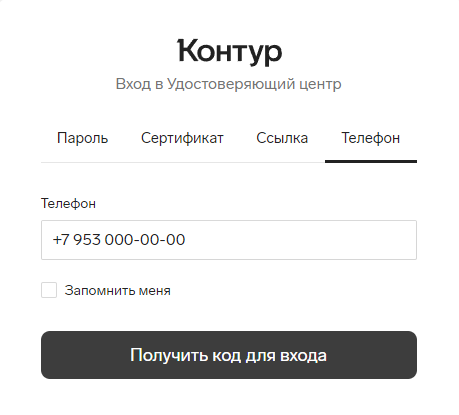{ width="500" }
         </figure>

      <br><br><br>
     Дождитесь звонка и введите 4 последние цифры номера. Отвечать на звонок не нужно.

      <figure markdown>
      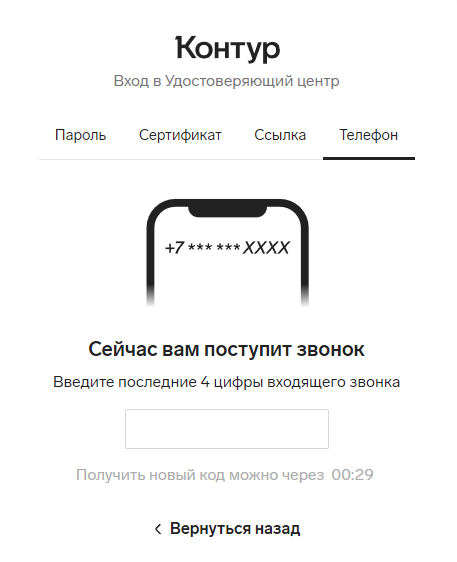{ width="500" }
      </figure>

     <br><br><br>
  3. В списке заявок на сертификаты найдите строку с сертификатом и нажмите «Заполнить заявку». 
       <figure markdown>
       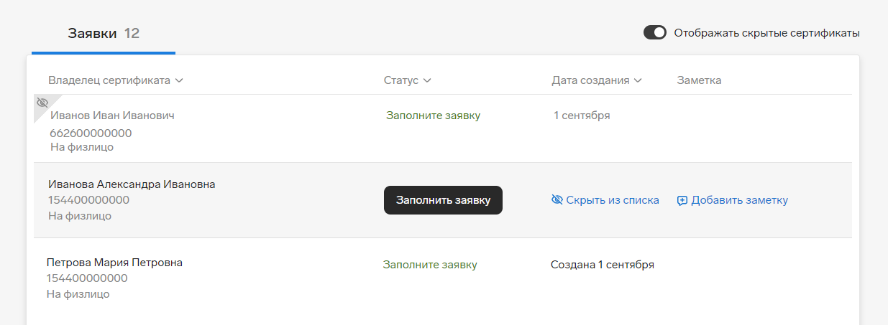{ width="1000" }
       </figure>
 
      <br><br>
  4. Ознакомьтесь с тем, что предстоит сделать.
        <figure markdown>
         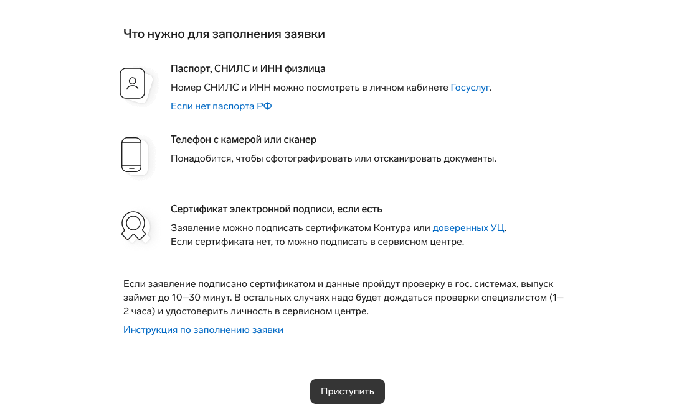{ width="1000" }
        </figure> Нажмите «Приступить».
      <br><br><br>
  5. Проверьте правильность введенных реквизитов. Если все верно, нажмите «Продолжить».:
        <figure markdown>
         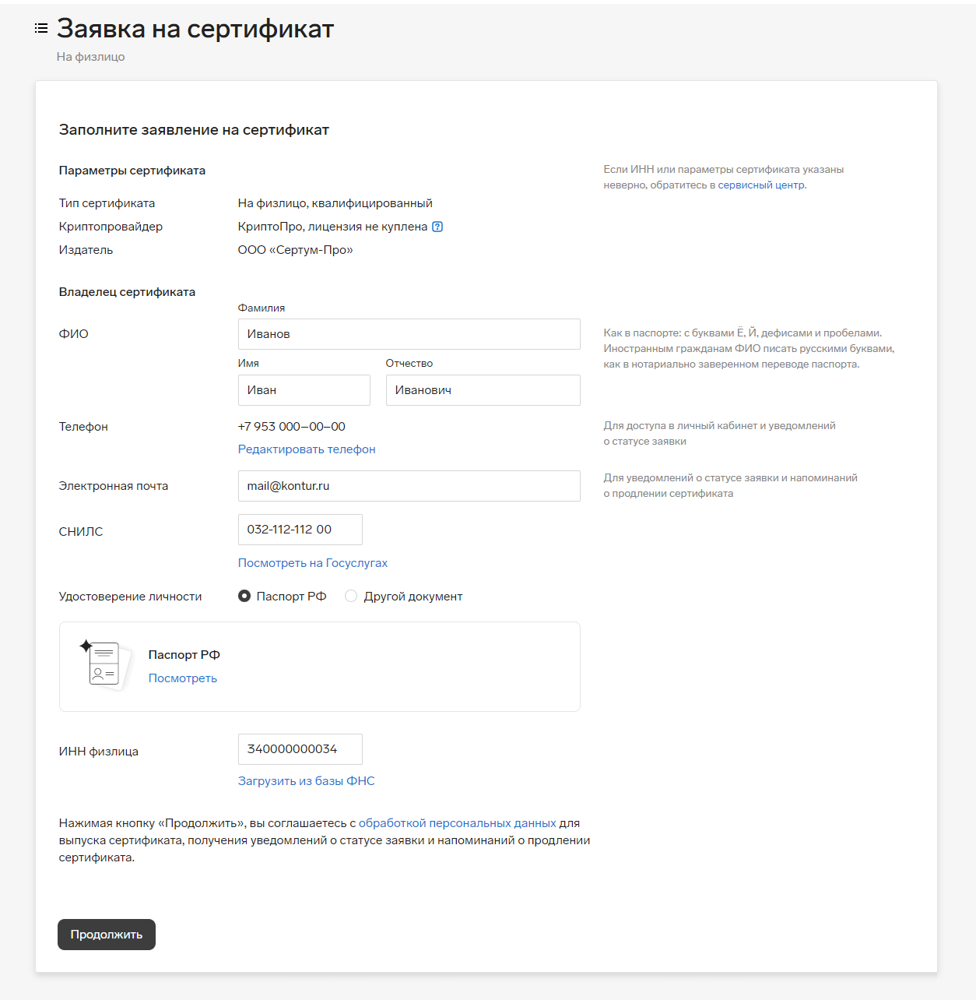{ width="900" }
        </figure>
      <br><br><br>

     Мы автоматически проверяем СНИЛС и ИНН, но если по каким-то причинам ФНС и СФР не отвечают, нужно загрузить документы самостоятельно.

      <figure markdown>
        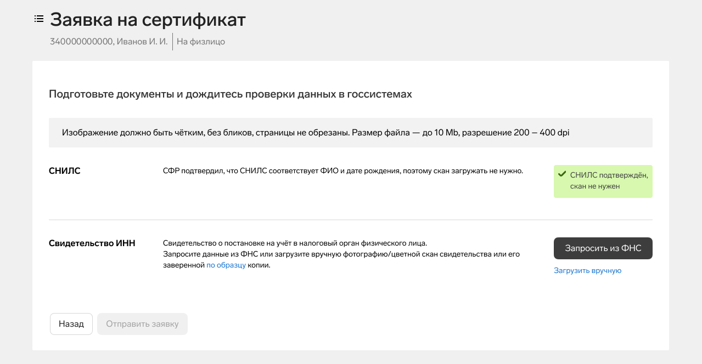{ width="1000" }
      </figure>

     Нажмите «Отправить заявку».

## Этап 2. Проверка заявки Удостоверяющим центром
Удостоверяющий центр проверит заявку в течение 1-2 часов. Если от вас потребуются дополнительные действия, они будут указаны на этой странице.


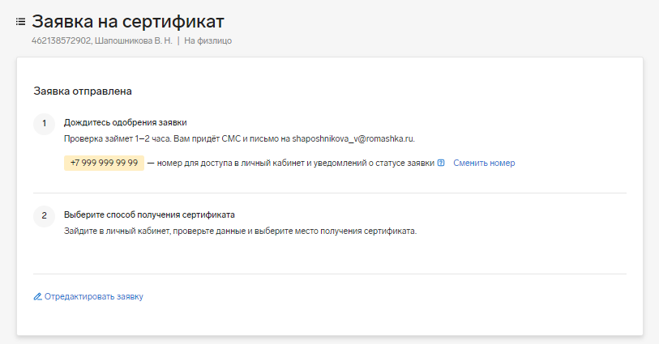{ width="900" }


## Этап 3. Выпуск сертификата

  Выпустите и установите сертификат после поступления на почту или телефон сообщения, что сертификат готов к выпуску. Если вы вышли из личного кабинет, то снова войдите в него.

  1. Внимательно проверьте правильность реквизитов. Если все верно, нажмите «Продолжить». Если нашли ошибки,  нажмите на ссылку «отредактируйте заявку» и исправьте их.

     
       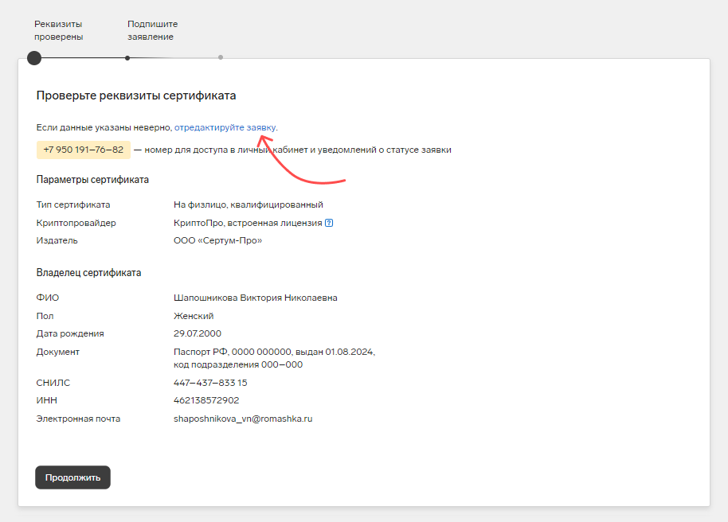{ width="900" }
      

     <br><br><br>
  2. Выберите, как подписать заявление:


  {==

!!! note "Примечание"
 Если у вас нет действующего сертификата, заявление нужно будет подписать и передать сотруднику, отвечающему за выпуск сертификатов в вашей организации. Выберите этот вариант, чтобы заранее подписать заявление и передать его 
 на проверку операторам УЦ.
 
  ==}

* * Нажмите «Скачать», чтобы сохранить бланк заявления.
* * Распечатайте, подпишите заявление и сделайте скан.
* * Нажмите «Загрузить» и выберите файл с подписанным заявлением.
* * Проверьте, что загружен нужный документ и нажмите «Сохранить и закрыть».
* * Нажмите «Продолжить».

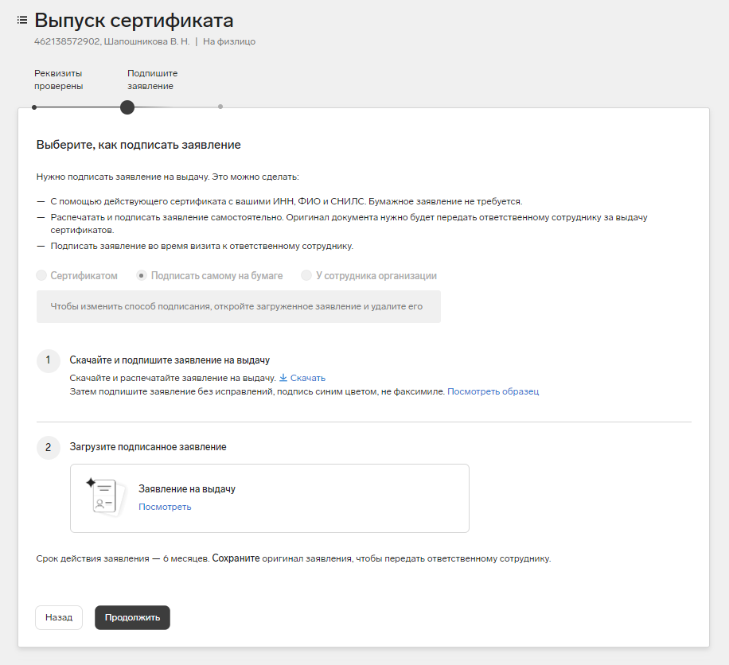{ width="800" }


<br><br>
Дождитесь одобрения заявления в УЦ.

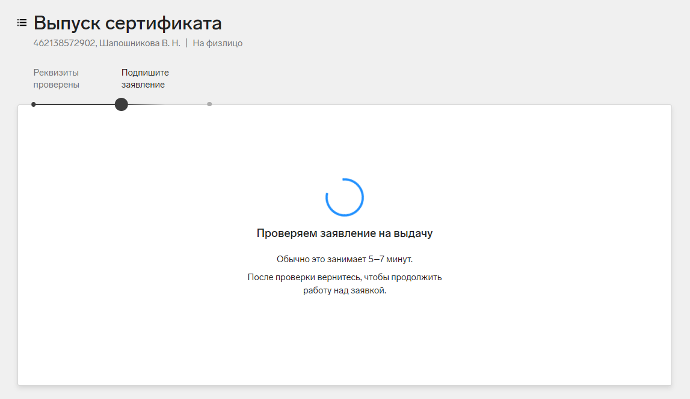{ width="800" }<br><br><br>

Если к документу возникли замечания: 

 1. Ознакомьтесь с причиной отказа в поле «Комментарий»;
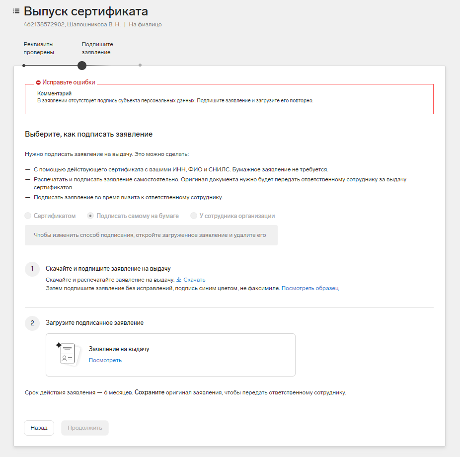{ width="800" }
 2. Внесите исправления в соответствии с комментарием;
 <br><br><br>
 3. Удалите прежнюю копию документа из заявки. Для этого нажмите «Посмотреть» под заявлением, затем в открывшемся окне «Удалить»;
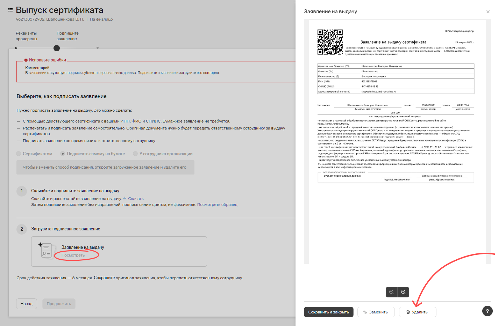{ width="1000" }
 4. Загрузите корректный файл и нажмите «Продолжить», чтобы отправить новое заявление на проверку.

## Этап 4. Выбор места хранения сертификата и создание закрытого ключа
 1. Выберите, куда будет записан сертификат.
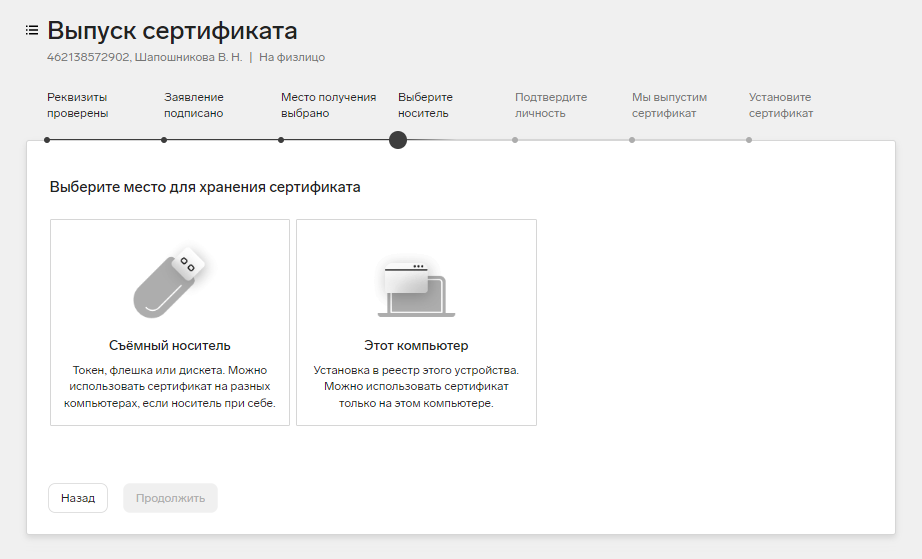{ width="800" }

  Если вы получили токен (рутокен,) от организации, подключите его к компьютеру, нажмите «Съемный носитель», выберите соответствующий токен. 
  Нажмите «Продолжить».

После выбора места для хранения сертификата появится датчик случайных чисел. Нажимайте клавиши или двигайте курсором мыши в области окна датчика.
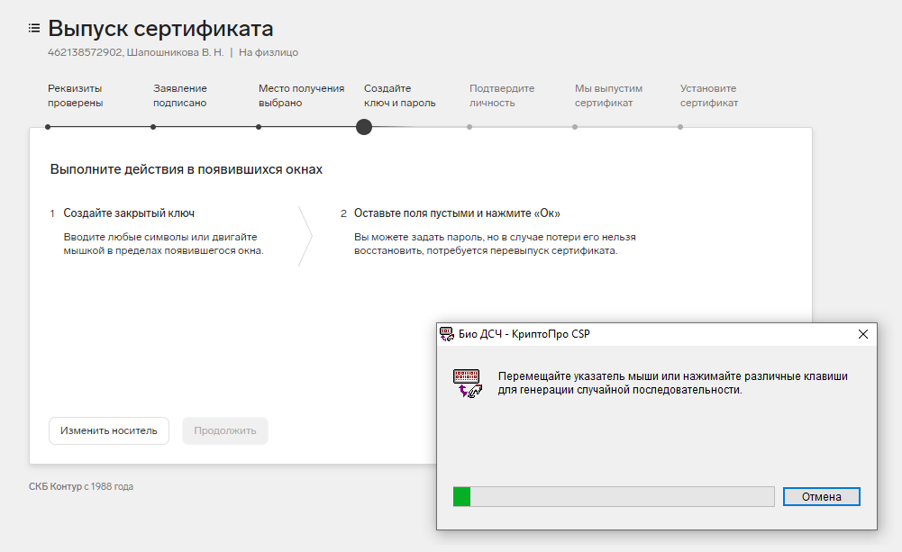{ width="800" }


???+ note "Примечание"
     Если сертификат устанавливается на рутокен, появится поле для пин-кода. Введите стандартное значение 12345678 и нажмите «ОК». Если стандартный пин-код на рутокене ранее был изменен, введите пин-код, установленный самостоятельно.


!!! danger "Важно!"
    Важно: при утере пароля восстановить его будет невозможно!


## Этап 5. Подтверждение личности 
Если заявление подписано КЭП и все данные прошли проверку в госсистемах, сразу начнется выпуск сертификата. Дождитесь его и переходите к следующему этапу.
В ином случае свяжитесь с сотрудником, ответственным за выпуск сертификатов в вашей организации, для передачи оригинала заявления.

## Этап 6. Установка сертификата
Если выбрали съемный носитель, вставьте его в компьютер и нажмите «Установить сертификат». 

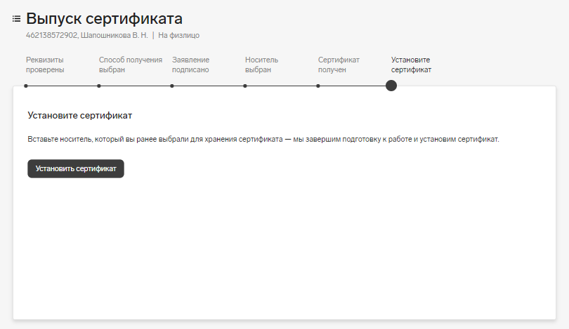{ width="800" }

При использовании токена появится поле «Pin-код». Введите стандартное значение для вашего токена и нажмите «Ок». Если вы меняли стандартный пин-код, то введите тот, который указали сами. Поле для ввода пин-кода не появится, если вы ранее нажимали «Запомнить пароль».