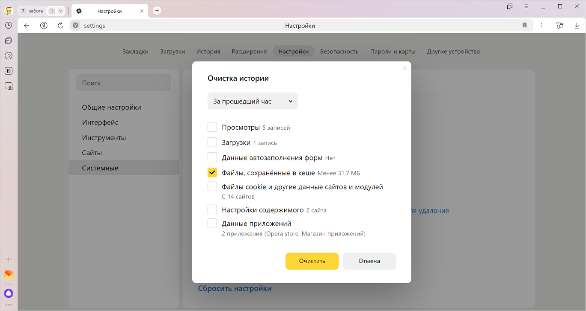

# Очистка Кэша браузера

Чтобы очистить кеш:

1. Нажмите →  → История → Очистить историю либо сочетание клавиш ++ctrl+shift+del++

2. В списке Очистка истории выберите период для удаления кеша за все время : { width="300" }

3. Включите опцию Файлы, сохранённые в кеше.

4. Отключите остальные опции (если хотите очистить только кеш Браузера).

5. Нажмите Очистить.

